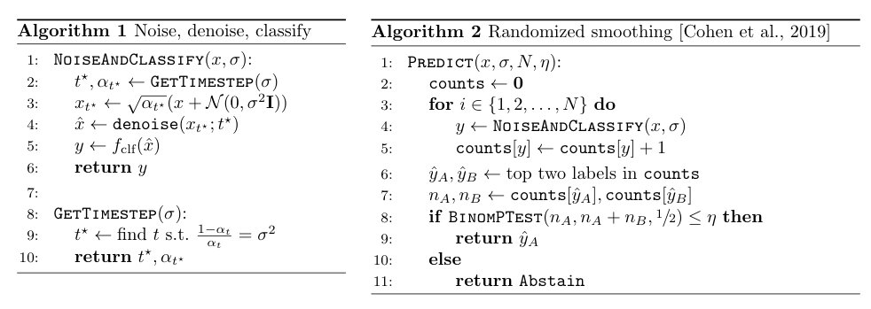

# Diffusion Denoised Smoothing

This is a PyTorch implementation of **Diffusion Denoised Smoothing**, proposed in our ICLR 2023 paper:

>(Certified!!) Adversarial Robustness for Free!      
>Nicholas Carlini*, Florian Tramèr*, Krishnamurthy Dvijotham, Leslie Rice, Mingjie Sun, J. Zico Kolter   

For more details, please check out our [<ins>**paper**</ins>](https://arxiv.org/abs/2206.10550).


---
We show how to achieve state-of-the-art certified adversarial robustness to 2-norm bounded perturbations by relying exclusively on off-the-shelf pretrained models.
<p align="center">

</p>

This repository is based on [locuslab/smoothing](https://github.com/locuslab/smoothing), [openai/improved-diffusion](https://github.com/openai/improved-diffusion) and [openai/guided-diffusion](https://github.com/openai/guided-diffusion).


## Setup
Create an new conda virtual environment:
```
conda create -n diffusion_smoothing python=3.8 -y
conda activate diffusion_smoothing
```
Install Pytorch, torchvision following official instructions. For example:
```
conda install pytorch==1.12.0 torchvision==0.13.0 cudatoolkit=11.3 -c pytorch
```
Clone this repo and install the dependencies:
```
git clone https://github.com/ethz-privsec/diffusion_denoised_smoothing.git
pip install timm transformers statsmodels
```


We use these class-unconditional diffusion models from these repos:  
[CIFAR-10](https://github.com/openai/improved-diffusion): Unconditional CIFAR-10 with `L_hybrid` objective.  
[ImageNet](https://github.com/openai/guided-diffusion): Uncondtional 256x256 diffusion.  
Remember to download these model checkpoints in the corresponding directory.

## Evaluation
We give example evaluation command to run certification on CIFAR-10 and ImageNet.
```
# CIFAR-10
python cifar10/certify.py \
--sigma 1.00 --skip 1 --N0 100 --N 100000 --batch_size 200 \
--outfile [file to store certification results]
```

```
# ImageNet
python imagenet/certify.py \
--sigma 1.00 --skip 50 --N0 100 --N 10000 --batch_size 200 \
--outfile [file to store certification results]
```
## License
This project is released under the MIT license. Please see the [LICENSE](LICENSE) file for more information.

## Citation
If you find this repository helpful, please consider citing:
```
@Article{carlini2023free,
  author  = {Carlini, Nicholas and Tramèr, Florian and Dvijotham, Krishnamurthy and Rice, Leslie and Sun, Mingjie and Kolter, Zico},
  title   = {(Certified!!) Adversarial Robustness for Free!},
  journal = {International Conference on Learning Representations (ICLR)},
  year    = {2023},
}
```